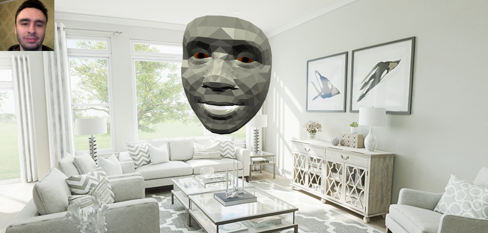

# Sensoria 

This project is a demo for P2P WebRTC communication in 3D space using TensorFlowJS [Face-Landmarks-Detection](https://github.com/tensorflow/tfjs-models/tree/master/face-landmarks-detection) for face & iris tracking.

What you will see in unfiltered result of TensorFlow Facemesh (WASM backend - СPU computations).

Virtual camera has fixed location, while face mesh moves freely around it.

## Concept
Once I was on massive online Zoom event and I felt lots of video "rectangles" make me feel a bit disconnected.
So I became curious are there alternative solutions, that do not require VR goggles, and still providing immersive experience.

Projecting video as 2D rectangle into 3D space still breaks immersion, so I opted for Face Detection.

## Try it
Available here: https://sensoria.herokuapp.com

Trick: you can open Sensoria in another browser tab to simulate conversation.

Chrome browser is recommended.

Model was originally trained for smartphones, so you should be close to camera for the best result.

## Run it locally
This is regular NodeJS app written in vanilla JS, with frontend and backend separated and no frameworks used (no build step for frontend).

## Data transmission
Instead of video feed 468 xyz points are sent. For 30 FPS, it roughly equals to 30 * 468 * 3 = 1.5 mbps, equals to compressed video feed.

Upside is that de-compression step is not required, points can be directly rendered on 3D scene.

There is surely room for decreasing bandwidth, like transferring 2D points only, sending point deltas only etc.
